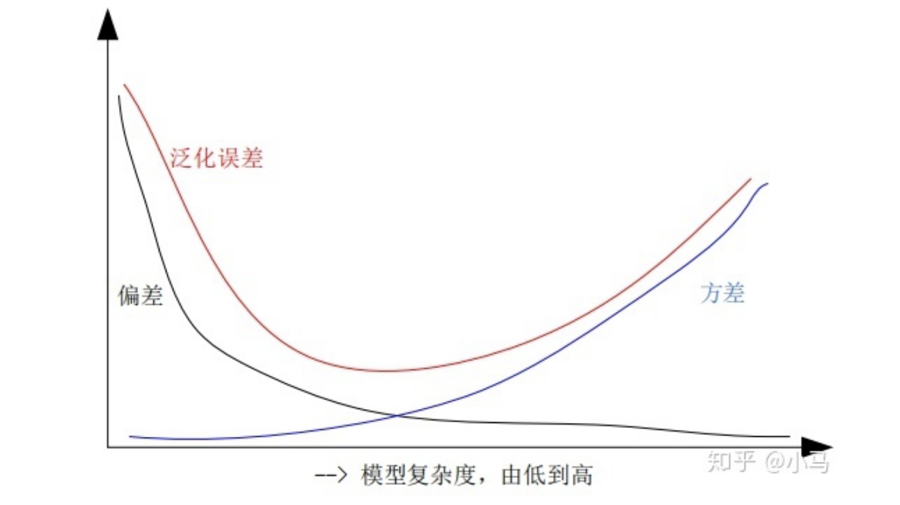
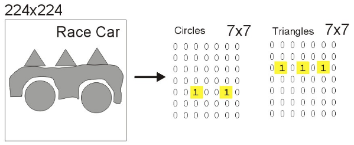
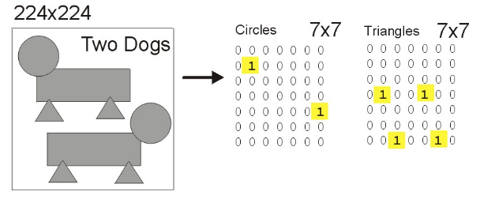

总结一些深度模型常用的调试优化技巧。
## 0x01 探索性数据分析 EDA(Exploratory Data Analysis)

## 0x02 正则化(Exploratory Data Analysis)
1. 常用方法
    - Z score Normalization（mean std Standardization）
    $$
       \frac{x-\overline{x}}{\sigma}
    $$
    - Min-Max Scaling
    - Standard Deviation Method
    - Range Method
2. 为什么需要使用正则化方法
    - For Cluster Analysis：通常情况需要度量不同输入间的距离，未正则化数据可能会存在特殊极值影响度量结果。
    - For Principal Component Analysis：PCA gives more weightage to those variables that have higher variances than to those variables that have very low variances（方差会影响降维结果）
    - 正则化能改变输入数据的分布，在数据预处理时通常包含两个步骤：Scaling & Normalize， Scaling负责将输入数据映射到0-1范围内，Scaling can help compare different variables on equal footing（在同样的步长上比较两个数据）; Normalization本质上是一种激进的策略，The point of normalization is to change your observations so that they can be described as a normal distribution.Normalization能够改变模型观察数据的角度，使输入数据可以被描述为一个正态分布。
    - Scaling(归一化)消除特征间单位和尺度差异的影响，以对每维特征同等看待，需要对特征进行归一化。
    - 因尺度差异，其损失函数的等高线图可能是椭圆形，梯度方向垂直于等高线,变换后，其损失函数的等高线图更接近圆形，梯度下降的方向震荡更小，收敛更快
    - 随着训练程度加深，模型复杂度会增加，偏差减少，方差增大，而泛化误差呈现 U 型变化，对于一个“好的系统”通常要求误差小，正则化的作用即为适当的控制模型复杂度，从而使得泛化误差曲线取最小值，从贝叶斯角度考虑，正则项等价于引入参数的模型先验概率，可以简单理解为对最大似然估计（MLE）引入先验概率，从而转化为最大后验估计（MAP），其中的先验概率即对于正则项
## 0x03: 如何选择CNN输入图像的尺寸
1. ImageNet 上预训练的backbone模型通常在224x224大小的输入图像上进行预训练，这并不意味着我们需要将输入图像resize到224x224大小
2. 以224x224大小的输入数据为例，假设输入图像经过网络输出的特征图大小为原始图像的$\frac{1}{32}$,如果将输入图像尺寸增大到512x512,则对应的输出特征图大小从7x7变为16x16，特征图的输出大小仅与网络本身结构和输入的图像大小有关。
3. 在模型中，与预训练尺寸有关的是网络从确定大小物体中学习到的固定模式，例如从输入图像中寻找直径为50个像素大小的圆，或是边长为30个像素的三角形。以下三个图为例

## 0xFF: References

\[1]: [Class-balanced-loss-pytorch](https://github.com/vandit15/Class-balanced-loss-pytorch)  
[2]: [When and why to standardize or normalize a variable?](https://www.kaggle.com/discussions/questions-and-answers/59305)  
[3]: [Data Cleaning Challenge: Scale and Normalize Data](https://www.kaggle.com/code/rtatman/data-cleaning-challenge-scale-and-normalize-data/notebook)  
[4]: [CNN Input Size Explained](https://www.kaggle.com/competitions/siim-isic-melanoma-classification/discussion/160147)  
